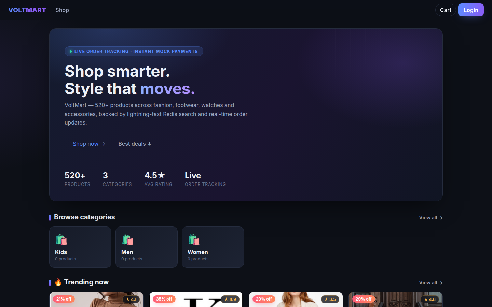
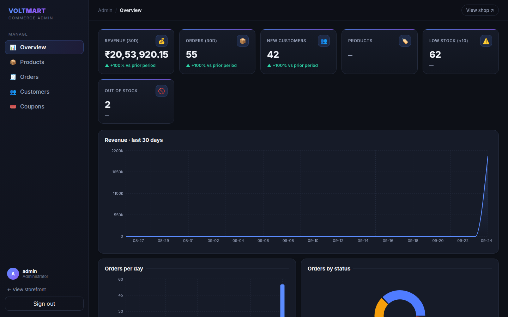

# VoltMart

A full-stack e-commerce platform: a Django REST API with a React single-page storefront and a staff-only admin dashboard.

The storefront covers the whole customer journey — browsing, search and filters, a cart, checkout with coupons, order tracking over WebSockets, and recommendations. The admin dashboard manages products, orders, customers, coupons, inventory, and analytics.



## Stack

| Layer    | Technology                                                              |
|----------|-------------------------------------------------------------------------|
| Backend  | Django 6, Django REST Framework, Channels                                |
| Frontend | React 19, Vite                                                           |
| Database | PostgreSQL (Docker) or SQLite (local dev)                                |
| Cache    | Redis (embedded `redislite` in dev)                                      |
| Auth     | JWT (simplejwt) with access and refresh tokens                           |
| Payments | Simulated gateway out of the box; Stripe-ready with a webhook adapter    |

## Features

- **Catalog** — 500+ seeded products across 10 brands and a category tree; paginated search, filtering (category, brand, price, in-stock), sorting, Redis-cached listing and detail endpoints, reviews with rating aggregation.
- **Cart & checkout** — cart management, coupon discounts, itemized pricing with tax and shipping.
- **Orders & payments** — payment-confirmed status flow with a time-stamped history, cancellations before shipment, and a simulated card gateway.
- **Live tracking** — every order status change is pushed to the tracking page over WebSockets (`WS /ws/orders/<id>/?token=<jwt>`); try it with `python manage.py advance_orders --order <id>`.
- **Recommendations** — trending, related products, frequently-bought-together (co-purchase analysis), and personalized "for you".
- **Admin dashboard** — KPIs with trend deltas, revenue and order charts, order/product/customer/coupon management, low-stock and restock tools.



## Demo access

| Login                    | Role  |
|--------------------------|-------|
| `admin` / `admin12345`   | Staff |
| `user1..user25` / `demo12345` | Customer |

Coupons: `WELCOME10`, `FLAT200`, `MEGA50`. Mock card: `4242 4242 4242 4242`.

## Getting started

Backend and frontend run independently; the Vite dev server proxies `/api`, `/ws`, and `/static` to Django.

**Backend**

```bash
cd backend
python -m venv .venv && source .venv/bin/activate
pip install -r requirements.txt
cp .env.example .env        # defaults: SQLite + embedded Redis
python manage.py start_redis
python manage.py migrate
python manage.py seed_products --count 520
python manage.py runserver
```

For WebSocket support, serve with Daphne instead: `daphne -b 127.0.0.1 -p 8000 config.asgi:application`.

**Frontend**

```bash
cd frontend
npm install
npm run dev
```

Open http://localhost:5173. Admin dashboard lives at `/admin`.

**Full stack with Docker**

```bash
docker compose up --build
```

This runs PostgreSQL 16, Redis 7, the API, and the SPA together (config through `DB_ENGINE` and `REDIS_URL`).

## API overview

All routes are prefixed with `/api/v1/`.

- `POST auth/token/` — login, returns access and refresh tokens
- `accounts/` — register, profile, addresses
- `catalog/products/` — list with `search`, `category`, `brand`, `price_max`, `ordering`; detail, reviews
- `catalog/categories/`, `catalog/brands/` — with product counts
- `cart/` — add, update, remove
- `orders/` — create from cart, list, detail, cancel
- `payments/orders/<id>/` — initiate / confirm
- `inventory/` — low-stock, restock, reports
- `inventory/admin/` — analytics, orders, customers, coupons, categories, brands
- `recommendations/` — trending, for-you, related, frequently-bought
- `dashboard/stats/` — KPIs for the admin view

## Project layout

```
backend/
  config/            settings (env-driven), URLs, ASGI (Channels)
  apps/
    core/            shared models, dashboard, pagination, permissions
    accounts/        auth, profiles, addresses
    catalog/         products, brands, categories, reviews, filters, caching, seeds
    cart/            cart and cart items
    orders/          orders, coupons, status history, services
    payments/        simulated and Stripe gateways
    inventory/       low-stock, restock, reports, admin API
    recommendations/ trending, related, co-purchase, for-you
    realtime/        WebSocket consumers and JWT middleware
frontend/            React 19 + Vite SPA
docs/                screenshots
docker-compose.yml   PostgreSQL + Redis + backend + frontend
```

## Configuration

Runtime settings live in `.env` (template in `backend/.env.example`):

- `DB_ENGINE=sqlite|postgres` — switch database without code changes
- `REDIS_URL` / `CACHE_BACKEND` — cache and WebSocket channel layer
- `STRIPE_SECRET_KEY` — enable the real Stripe gateway in place of the simulator
- `SHOP_SIMULATED_DELIVERY_DAYS` — delivery estimate for the simulator

## Management commands

`seed_products`, `start_redis`, `advance_orders`, and `benchmark` (caching measurements) live in `backend/apps/*/management/commands/`. Add demo data with `seed_products`; run `seed_products --count N` to control the size.